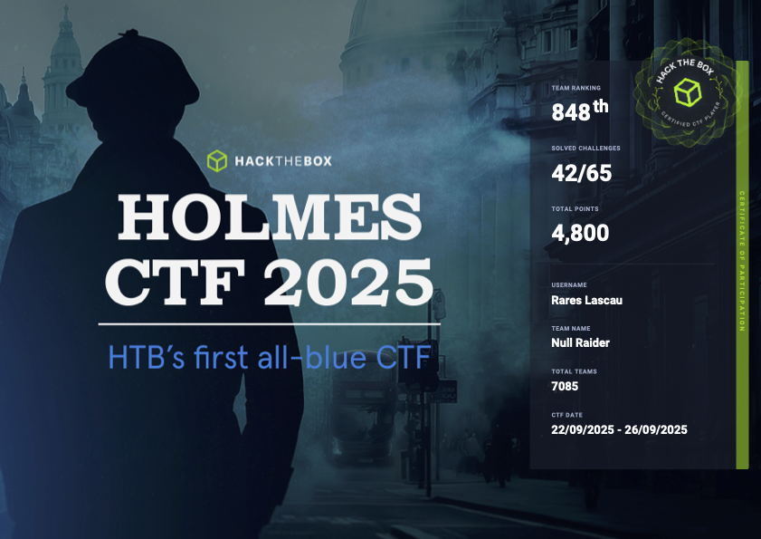

## 🏅 Holmes CTF 2025 — Participation
<p align="center">  
</p>

A small, focused portfolio of my Blue Team work from **Holmes CTF 2025**.  
My goal is to show how I think, investigate, and communicate as a **SOC analyst / DFIR responder** 

---

## 👋 Why this repo exists

- **Real analyst habits.** I start with a question, gather evidence, and keep a tidy chain-of-custody in the write-up (timestamps, event IDs, hashes, registry paths).
- **Detect-first mindset.** Every finding becomes a rule, query, or checklist item you can operationalize.
- **Clear reporting.** Each challenge has a short **timeline**, and **Lessons Learned**.

---

## 🔎 Highlights

- **Detection Engineering:** KQL/Sigma-style ideas, log source mapping (4688, 4720, 4698, 4104, TaskScheduler/Operational).
- **Host & Network Triage:** Event log parsing, registry hive inspection, `netsh portproxy`, scheduled tasks, host file tampering.
- **Threat-Led Investigations:** IOCs → CTI pivots → infra context (open ports, banners, ownership).
- **Communication:** Concise answers, evidence blocks, and “Quick Wins” for detection & hardening.

**Tooling I’m comfortable with:** Bash/grep/awk, Sysmon/Security.evtx, Reg hives (`reglookup`, `regipy`), PowerShell, Wireshark, Volatility, Impacket, Hashcat, Splunk/Elastic.

---

## 📚 Challenges

| #  | Name                     | Focus (SOC Skills)                     | Difficulty | Write-up |
|----|--------------------------|----------------------------------------|------------|---------|
| 01 | The Card                 | Indicator pivoting, web/WAF logs, CTI  | Easy       | [Read](01_The_Card.md) |
| 02 | The Enduring Echo        | Host triage, persistence, lateral move | Easy       | [Read](02_The_Enduring_Echo.md) |
| 03 | The Watchman’s Residue   | Cloud/service logs, secret leakage     | Medium     | [Read](03_The_Watchmans_Residue.md) |
| 04 | The Payload              | Malware behavior & propagation         | Hard       | Only Partialy Completed the Challenge |
| 05 | The Tunnel Without Walls | Memory forensics, covert channels      | Hard       | Only Partialy Completed the Challenge |

---

## 🧭 What “good” looks like in these write-ups

- **TL;DR:** one screen with all final answers.
- **How I worked:** the exact commands/queries I ran (copy/paste ready).
- **Evidence:** trimmed log/XML/registry snippets with the relevant fields highlighted.
- **Lessons Learned:** 5–8 bullets you can turn into controls or a playbook.

---

## 🧩 Quick teasers

### 01 — *The Card* (Web logs → CTI → Infra)
- Tracked the marker **`4A4D`** across UA strings, web shell, and database dump to stitch together the campaign.
- Turned findings into checks (web-shell uploads, `rc.local` persistence), plus a small infra profile (open ports, banner, owning org).

> **Value:** shows indicator pivoting discipline, CTI enrichment, and clear reporting.

### 02 — *The Enduring Echo* (Windows host triage)
- Rebuilt the attacker’s path from **4688** events: `WmiPrvSE.exe → cmd.exe` with `\\127.0.0.1\ADMIN$` redirection → **Impacket `wmiexec.py`**.
- Caught persistence via a **SYSTEM scheduled task** running `JM.ps1`, recovered **NTLM**, and derived the timestamp-based password.
- Identified the **port proxy** pivot (`netsh interface portproxy v4tov4 …`) and the exact registry path for persistent rules.

> **Value:** demonstrates event-driven reasoning, registry analysis, and practical detections you can deploy.

---

## 🛡️ Ready-to-use “Quick Wins”

These came straight from the investigations and are easy to operationalize:

- **Alert:** `WmiPrvSE.exe` spawning `cmd.exe`/`powershell.exe` **AND** command lines containing `\\127.0.0.1\ADMIN$`.
- **Monitor:** `HKLM\SYSTEM\CurrentControlSet\Services\PortProxy\v4tov4\tcp` for new values (silent pivot).
- **Hunt:** New SYSTEM **Scheduled Tasks** executing scripts from `%USERPROFILE%\AppData\Local\*.ps1`.
- **Guardrails:** Alert/block `netsh advfirewall set allprofiles state off` and **hosts file** edits adding non-corporate domains.
- **Logging baseline:** Ensure **4688 with CommandLine** and **PowerShell 4104** are enabled.

---

## 🗂️ Repo Structure

```text
Holmes-CTF-Writeups/
├─ 01_The_Card.md
├─ 02_The_Enduring_Echo.md
├─ attachments/            # screenshots / figures referenced in write-ups
